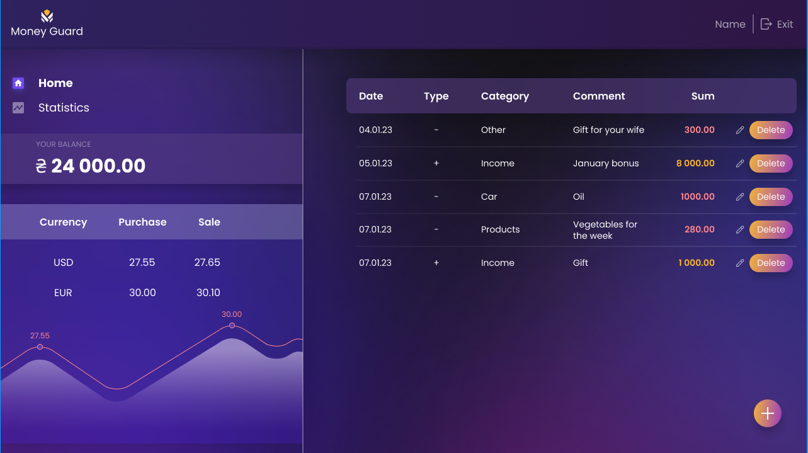
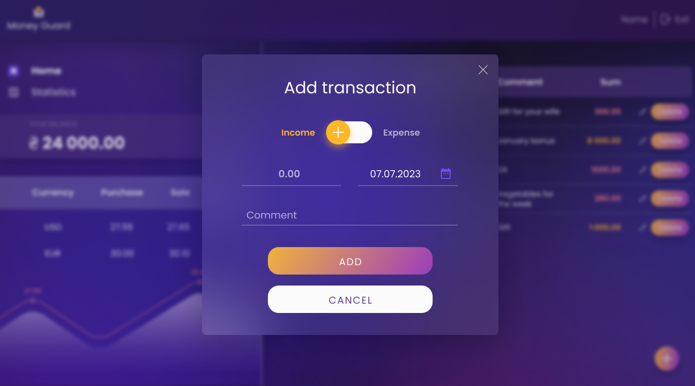
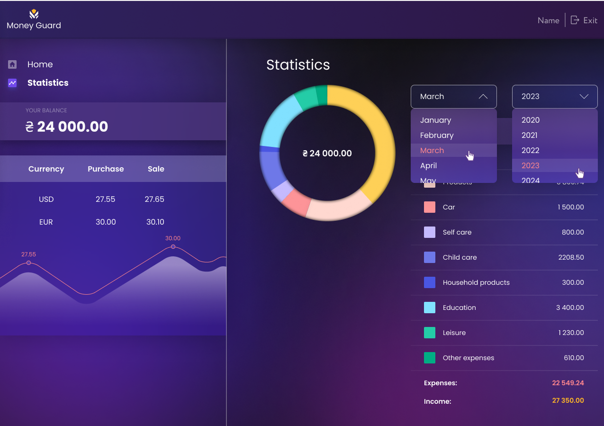

A modern finance dashboard for managing income and expenses — featuring
authentication, live currency rates, and detailed spending statistics.

🔗 Live Demo: https://Abiatar-Cosma.github.io/Money-Guard

📘 Backend API Docs: https://wallet.b.goit.study/docs/

📸 Demo & Screenshots

   <em>Login / Register</em> 
 
   <em>Dashboard / Transactions</em> 
 
   <em>Add Transaction Modal</em> 
 
   <em>Statistics Tab</em> 

🧩 Tech Stack

React 18, React Router (HashRouter for GitHub Pages)

Redux Toolkit, redux-persist

Formik + Yup — form handling and validation

react-loader-spinner — global loader

Chart.js + react-chartjs-2 — statistics charts

Recharts — currency chart

styled-components + CSS Modules

gh-pages — static deployment

API: wallet.b.goit.study

⚙️ Features & Architecture 🧭 App & Routing

Public routes: /login, /register

Private routes: /dashboard (Home / Statistics / Currency)

Automatic redirect based on authentication state

🔐 Authentication

JWT token stored in localStorage via redux-persist

Token automatically applied to all API requests on startup

🏦 Dashboard

Header: logo, username (email prefix), logout with confirmation modal

Navigation: /home, /statistics, /currency (on mobile)

Balance: connected to finance.totalBalance from Redux store

Transactions:

Scrollable table (desktop) or card view (mobile)

Real-time updates on edit/delete

Modals:

Add/Edit transactions using Formik + Yup

react-datepicker for date selection

💹 Currency

Fetches live exchange rates via Frankfurter API / ECB

Cached locally for 60 minutes in localStorage

Displays USD & EUR buy/sell rates + timestamp

Lightweight Recharts visualization

🚀 Local Setup

# 1. Clone

git clone https://github.com/Abiatar-Cosma/Money-Guard.git cd Money-Guard

# 2. Install dependencies

npm install

# 3. Run development server

npm start

If you see Browserslist warnings:

npx update-browserslist-db@latest npm install

📜 NPM Scripts { "start": "react-scripts start", "build": "react-scripts build",
"test": "react-scripts test", "eject": "react-scripts eject", "lint:js": "eslint
src/\*_/_.{js,jsx}", "predeploy": "npm run build", "deploy": "gh-pages -d build"
}

🧭 Routing

For GitHub Pages, HashRouter is used:

import { HashRouter as BrowserRouter } from 'react-router-dom';

To switch to BrowserRouter, add:

<BrowserRouter basename="/Money-Guard">

and create a 404.html in the public/ folder for fallback routing.

🗄️ Redux & Persistence

Store built with Redux Toolkit

redux-persist keeps the token in localStorage

On startup, if a token exists → setToken(token) is called (see
config/userTransactionsApi.js)

💹 Currency Module

Uses Frankfurter API (ECB): https://api.frankfurter.app/latest?from=USD&to=EUR

Cached for 60 minutes in localStorage

Displays USD/EUR buy & sell rates (5% spread)

Shows “1 EUR ≈ X USD” conversion

Built-in Recharts visualization + last update timestamp

🏗️ Build & Deploy to GitHub Pages

Add to package.json:

"homepage": "https://Abiatar-Cosma.github.io/Money-Guard"

Deploy with:

npm run deploy

Configure GitHub Pages:

Go to Settings → Pages

Source: Deploy from a branch

Branch: gh-pages → / (root)

Using HashRouter ensures no 404 errors when refreshing internal pages.

✅ Project Highlights

Updated favicon & app title → Money Guard

Global CSS variables & connected fonts

Redux Toolkit + redux-persist (token storage)

“Get current user” logic on app load

Private/Public routing

Registration/Login forms (Formik + Yup validation)

Responsive dashboard (react-responsive)

Header with user info & logout modal

Navigation (Home / Statistics / Currency)

Currency fetch + caching + chart + timestamp

Balance connected to Redux store

Global loader (react-loader-spinner)

Transactions list & live updates

Add/Edit Transaction modals (Formik + Yup + react-datepicker)

Statistics charts, month/year filters, and category table
